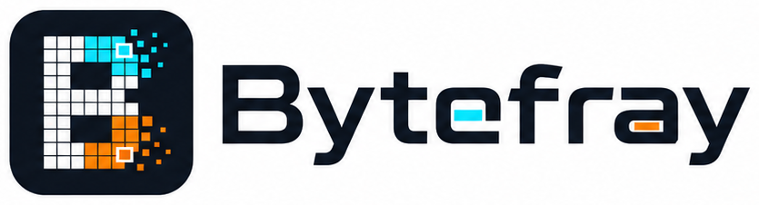
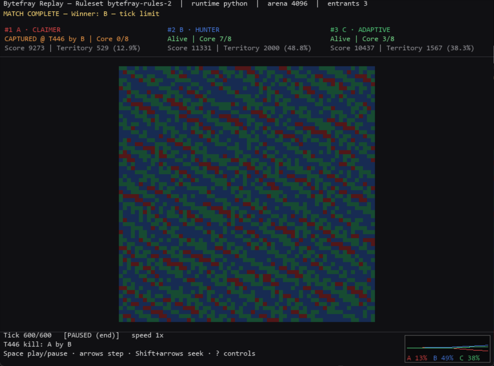
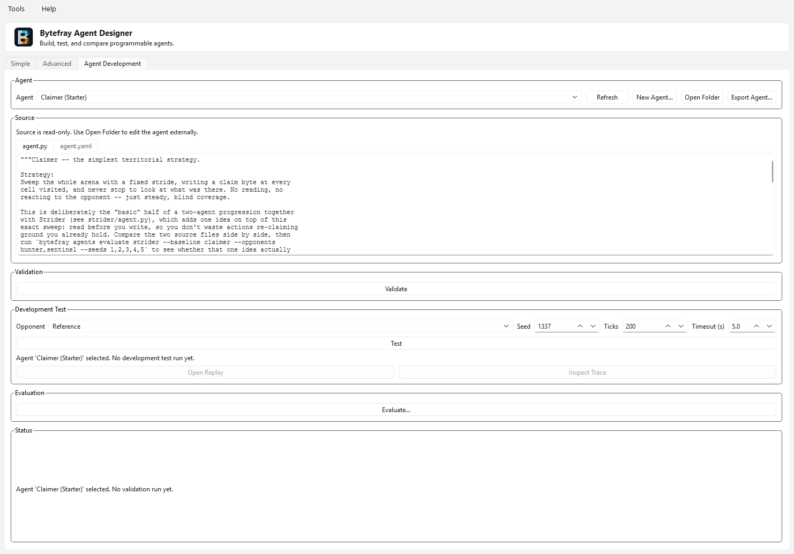

# Bytefray

<p align="center">
  
</p>

**Bytefray** is a programmable-agent arena, inspired by Core War, where deterministic VM and Python agents compete in a shared memory arena. It supports:

- Python agent discovery, Agent API v1 validation, and homogeneous Python-vs-Python matches
- Precompiled binary “blob” agents  
- Integration with pMARS (Redcode) for interop  
- Replay viewing and agent design tools  

Matches, results, and replays are fully deterministic and canonically recorded, with a headless tournament service for round-robin competitions. Agents can be authored by hand or generated with the help of an LLM, but Bytefray itself does not require one to run — it is a competitive engine and simulation platform, not an LLM benchmark.

This project is released under the **MIT License**. See the [LICENSE](LICENSE) file for details.

[](https://github.com/libertaine/Bytefray/releases)
[](CHANGELOG.md)
[](LICENSE)

<p align="center">
  
</p>

The project history, including its earlier name, is preserved in
[docs/PROJECT_HISTORY.md](docs/PROJECT_HISTORY.md). Current commands,
executables, paths, and environment variables use the Bytefray name only.

## AI-Assisted Development

Bytefray's own development optionally uses AI tooling — coding agents, code
review, and bounded local-model analysis — under human direction. This is
project methodology, not a Bytefray feature: nothing described here is
required to build, install, or run Bytefray, create or run agents, execute
tests, use Agent Designer, run CI, or produce a release. See
[docs/DEVELOPMENT_METHOD.md](docs/DEVELOPMENT_METHOD.md) for the full
policy, including optional local [Ollama](https://ollama.com) tooling.

---

## Roadmap

Bytefray started as a minimal headless engine plus a Pygame runner and Qt
designer, then grew a dedicated agent-authoring and evaluation toolchain one
milestone at a time. This is a compact map of that evolution, not a
substitute for the detailed [CHANGELOG](CHANGELOG.md).

| Version | Milestone | Status / Summary |
|---|---|---|
| 0.1.0 | Initial Windows Release | Released — first public build: headless CLI, Pygame match runner, Qt-based Agent Designer, installer and portable archive. |
| 0.2.0 | Unified CLI & Packaging | Released — unified `battle2` dispatcher, canonical replay schema, Python wheel packaging (3.10–3.13), writable platform data roots, headless Linux CI. |
| 0.3.0 | Bytefray Rename & Native Core | Released — renamed BATTLE2 → Bytefray; added Agent API v1 Python agents, deterministic Python-vs-Python matches, the `battle2.result`/`battle2.replay` schemas, an interactive Pygame replay viewer with territory analysis, and a resumable headless tournament service. |
| 0.4.0 | Agent Authoring & Development Feedback Loop | Released — `agents create → validate → test` from both the CLI and a new Designer "Agent Development" tab, plus a reusable, Pygame-free replay-analysis module. |
| 0.5.0 | Agent Lab | Released — versioned agent traces, supervised worker-subprocess execution with OS-level timeout/process containment, `agents inspect`/`agents diverge`, and a Designer Trace Inspector. |
| 0.5.1 | Cross-Platform / Packaging Hardening | Released — patch release. **Major fixes:** preserved the Linux virtualenv interpreter instead of resolving through its symlink to the base Python (which broke supervised workers), and stopped dynamic agent imports from leaving `__pycache__` contamination; also folded in late v0.5.0 frozen-build fixes (PyYAML missing from some frozen Windows executables, Designer subprocesses resolving the wrong data root in portable mode). |
| 0.6.0 | Agent Evaluation | Released — deterministic candidate/baseline evaluation matrices (`agents evaluate`) built directly on the exact `agents test` execution boundary, plus duplicate-cell correctness fixes found during release validation. |
| 0.6.1 | Default Agent Build-Out | Released — five bundled Python starter agents (Claimer, Strider, Hunter, Wanderer, Adaptive) demonstrating distinct, empirically balanced strategies, replacing the single fixed-behavior scaffold as every new user's first Python match. Surfaced an open scoring-model question — whether continual territory-claiming is structurally favored over observing or defending — that a future ruleset-review milestone (see **Future / unscheduled** below) will need real, unbiased evaluation tooling to study properly. |
| 0.7.0 | Evaluation History | Released — `bytefray.evaluation` v2, persistent evaluation history (`evaluations list`/`show`/`compare`), execution provenance, and reproducibility-aware comparison against a stable baseline. **Major hardening:** frozen execution identity, local-source fingerprinting, resume/retry durability, malformed-artifact isolation, fail-closed execution-context validation, and replay/path containment. |
| 0.8.0 | Agent Revision & Provenance | Released — durable identity/provenance for agent revisions, so historical evaluation results stay meaningful as an agent's source keeps evolving: a content-addressed revision store, freeze-time archival wired into `agents evaluate` (schema v3's additive `agent_revisions` field), revision-aware `evaluations show`/`--verify`, and `agents revisions list`/`show`/`restore`. **Major hardening:** fail-closed restore/snapshot verification, cross-platform artifact path containment, and Windows junction/reparse-point containment. |
| 0.9.0 | Orientation-Aware Evaluation | Released — closed a structural first-mover bias present in every `agents evaluate` cell ever run (the candidate always occupied the always-first-acting physical slot; a shipped starter agent already documented and exploited this). Both entrant orientations (`candidate_first`/`opponent_first`) now run by default as independent, fully provenance-tracked cells; `--single-orientation` restores the exact legacy methodology. `bytefray.evaluation` bumps to schema/identity v4; every evaluation also now explicitly discloses that arena alignment is fixed (translation robustness remains research work, not yet evaluated). A ruleset-review investigation conducted during v0.9 development (scoring counterfactuals, capped-territory experiments) found no gameplay-rule change justified yet, and reprioritized this entrant-orientation fix ahead of it, on the reasoning that the tool measuring the rules needed fixing first. |
| 0.10.0 | Platform Stabilization / v1.0 Readiness | Released — a stabilization release, not another feature release: froze the Bytefray 1.0 rules contract (`bytefray-rules-1`), closed the entrant-orientation-vs-translation evaluation-methodology question, defined the stable Agent API v1 and compatibility model, persisted Ruleset identity into native result/replay artifacts, hardened canonical match identity, and completed release qualification and first-user-workflow/packaging fixes. See [docs/ROADMAP.md](docs/ROADMAP.md). |
| 1.0.0 | Stable Bytefray Platform | Released — a maturity milestone, not a feature checklist: the documented Agent API, ruleset, and schemas are declared stable for the 1.x series and historical artifacts stay intelligible throughout it. Promotes `v1.0.0-rc2` (which closed the required pre-1.0 branding/visual-integration gate and an Agent Designer runtime-kind match-selector correction) to general availability, following full RC-level qualification; no gameplay, Agent API, Ruleset, or evaluation-schema change beyond what the release candidates already shipped. See [docs/ROADMAP.md](docs/ROADMAP.md#v100--stable-bytefray-platform). |
| 1.0.1 | Post-1.0 Maintenance | Released — patch release. **Fix:** the Agent Designer Advanced tab's per-agent JSON params were silently discarded instead of reaching the agent process. Otherwise repository/build cleanup: removed dead code and ~132MB of committed build output, consolidated packaging/sync tooling, established a Ruff-clean baseline enforced in CI, and refreshed contributor/security documentation. No gameplay, Agent API, Ruleset, or evaluation-schema change. |
| 1.1.0 | Evaluation Insight & Designer Polish | Released — brings the already-shipped v0.7/v0.8 evaluation-history and agent-revision engine layers into Agent Designer: a Tools → Evaluation History… browser for past `agents evaluate` runs (including legacy artifacts), comparability-first two-run comparison, and agent-revision provenance inspection with a live current-source-drift check the CLI itself doesn't have. No gameplay, Agent API, Ruleset, or evaluation/result/replay-schema change. |
| 1.2.0 | Portable Agent Packaging & Sharing | Released — extends the existing content-addressed agent-revision store across a machine boundary: `agents export`/`agents package show`/`agents import` package one agent revision into a portable, inspectable-without-execution `.bytefray-agent` file, transfer it by any ordinary means, and import it through fail-closed validation into another installation with its `agent_revision_id` and provenance metadata preserved. Adversarially tested against path traversal, tampering, and collision, and qualified with a genuine cross-platform (Windows/Linux) round trip. Introduces exactly one new, independent compatibility axis (`bytefray.agent_package` schema v1); no gameplay, Agent API, Ruleset, or evaluation/result/replay-schema change. |
| 1.3.0 | Designer Workflow Completion | Released — adds Agent Designer package export/inspection/import with integrity and trust disclosure, exact comparison-row Replay/Agent Lab drill-down with side/orientation/tick preservation, and revision **Restore Files…** with live-catalog refresh and stale-state invalidation. Independent qualification hardened package/archive validation, corrected all four Windows PyInstaller layouts to the intended onedir shape, made GUI build smokes isolated and synchronous, and added CLI disclosure of ambiguous duplicate comparison groups. Technical and manual GUI qualification passed; the installer, portable applications, wheel, source archive, and published SHA-256 values were verified for the final release. No gameplay, Agent API, Ruleset, package/revision/evaluation/result/replay-schema, evaluation-methodology, or data-root-semantics change. |
| 1.4.0 | Platform Integrity & Scaling | Released — retires obsolete predecessor product surfaces, removes evidence-backed dead code, freezes a compact Ruleset-v1 VM/Python equivalence corpus, replaces duplicate per-tick ownership scans with authoritative incremental counts, records scaling/replay evidence, and qualifies existing three-entrant execution. No gameplay or stable-contract change. |
| 1.4.1 | Designer Agent-Selection Fix | Released — fixes Simple and Advanced match launch when an agent's display name differs from its canonical discovery ID, with realistic end-to-end GUI regression coverage. No gameplay or stable-contract change. |
| 1.5.0 | Architecture Evolution Readiness | Released — a fail-closed Ruleset-v1 policy/dispatch seam, one shared sequential-quota scheduler, centralized Ruleset-v1 termination resolution, and entrant identity separated from resolved match inputs and mutable execution state, all directly verified equivalent to v1.4.1 Ruleset-v1 behavior. Still exactly one execution state per entrant; no gameplay, Agent API, Ruleset ID, or schema change. |
| 1.6.0 | Evaluation Scale & Analysis | Released — bounded local parallel evaluation (`--workers N`) via a pool of long-lived worker subprocesses, reusable/reproducible evaluation presets, Wilson-interval and exact paired significance analysis, and derived behavior-profile analytics (survival, write activity, territory, kill interaction), all fully derived from existing evaluation artifacts with worker count and preset identity confirmed not to affect `evaluation_id` or any per-cell result. Larger experimental matrices and replay indexing remain deferred, not yet warranted by evidence. |
| 2.0.0-beta2 | Evaluation & Multi-Entrant Methodology | Released (beta) — Ruleset-v2 evaluation now balances pairwise placement/order/seed conditions and supports generic multi-entrant group matrices, symmetric per-entrant strategic analysis, deep verification, comparison, self-play disclosure, and deterministic resume across explicit v4/v5/v6 methodology identities. Ruleset v1, Ruleset-v2 gameplay, and Agent API v1 are unchanged. Published as a prerelease; not yet the stable 2.0 line. See [docs/ROADMAP.md](docs/ROADMAP.md). |
| 2.0.0-beta3 | Product Presentation & Workflow | Release preparation in progress — responsive multi-entrant Replay Viewer presentation, clearer Designer startup states, and complete Pairwise/Group evaluation configuration, preview, results, and history workflows. No gameplay, Ruleset, Agent API, schema, or evaluation-identity change. See [docs/ROADMAP.md](docs/ROADMAP.md). |
| 2.x | Further Gameplay / Rules Research | Research boundary beyond the Ruleset-v2 program above — possible multi-unit entrants, replication, communication, richer attack/resource semantics, and Agent API v2; no detailed design commitment yet. |

**Future plans:** substantial ideas are deliberately kept behind explicit
compatibility boundaries. Architecture preparation remains 1.x work; new
gameplay and Agent API v2 are 2.x research. The proposed deterministic DSL is
deferred until its Agent API v2 target is understood, online registry/PKI work
requires ecosystem demand, and pMARS remains maintained interoperability rather
than release-filling expansion. See the organized, maturity-labeled
catalogue in [docs/FUTURE_PLANS.md](docs/FUTURE_PLANS.md). Post-v0.9
development may also explore deeper optional local-AI developer tooling
(see [tools/local_ai/README.md](tools/local_ai/README.md)) — standardized
review packets, structured JSON review results, and benchmarking local
models against known historical Bytefray defects are candidate directions,
not promised for any specific release.

---

## Documentation

- [Agent Authoring Guide](docs/AGENT_AUTHORING.md)
- [Agent Lab: trace, inspect, diverge, timeouts](docs/AGENT_LAB.md)
- [Agent API v1 Technical Contract](docs/AGENT_API_V1.md)
- [Bytefray Ruleset v1 Reference](docs/RULES.md)
- [Canonical Result Schema](docs/RESULT_SCHEMA.md)
- [Replay Schema](docs/REPLAY_SCHEMA.md)
- [Headless Tournament Service](docs/TOURNAMENTS.md)
- [Compatibility Reference](docs/COMPATIBILITY.md)
- [Roadmap: v0.10 and v1.0](docs/ROADMAP.md)
- [Future Plans (post-1.0)](docs/FUTURE_PLANS.md)

---

## 🔧 Quick Start

### Clone & Install (dev mode)

```bash
git clone https://github.com/libertaine/Bytefray.git
cd Bytefray
python -m venv .venv
source .venv/bin/activate     # or `.\.venv\Scripts\activate` on Windows
pip install -e .             # engine, headless replay, and agent discovery
pip install -e ".[replay]"  # optional Pygame replay viewer
pip install -e ".[designer]" # optional PySide6 designer
```

> If you don’t need GUI tools, you can install just the core with:
>
> ```bash
> pip install -e .
> ```

---

## 📦 Downloads

**Stable release:** [Bytefray v1.6.0](https://github.com/libertaine/Bytefray/releases/tag/v1.6.0).
Earlier downloads are historical and have been superseded.

**Beta prerelease:** `v2.0.0-beta3` (Product Presentation & Workflow) —
publication pending; see
[CHANGELOG.md](CHANGELOG.md#200-beta3---2026-08-24) for what's new. It is
not a replacement for the stable v1.6.0 downloads below. Once published,
its downloads will be listed on the
[Releases page](https://github.com/libertaine/Bytefray/releases), tagged
`v2.0.0-beta3` and marked as a prerelease.

Previous beta downloads (`v2.0.0-beta2`):

| Type | File | Description |
|------|------|--------------|
| 🧰 **Windows installer** | [Bytefray-Setup-2.0.0-beta2.exe](https://github.com/libertaine/Bytefray/releases/download/v2.0.0-beta2/Bytefray-Setup-2.0.0-beta2.exe) | Installs under `C:\Program Files\Bytefray` |
| 💼 **Portable Windows applications** | [bytefray-2.0.0-beta2-windows.zip](https://github.com/libertaine/Bytefray/releases/download/v2.0.0-beta2/bytefray-2.0.0-beta2-windows.zip) | Complete onedir layouts for all four executables |
| 🐍 **Python wheel** | [bytefray-2.0.0b2-py3-none-any.whl](https://github.com/libertaine/Bytefray/releases/download/v2.0.0-beta2/bytefray-2.0.0b2-py3-none-any.whl) | Pure Python 3.10–3.13 package; does not contain pMARS |
| 📦 **Source archive** | [bytefray-2.0.0b2.tar.gz](https://github.com/libertaine/Bytefray/releases/download/v2.0.0-beta2/bytefray-2.0.0b2.tar.gz) | Source distribution for Python/package workflows |
| 🔐 **Checksums** | [SHA256SUMS.txt](https://github.com/libertaine/Bytefray/releases/download/v2.0.0-beta2/SHA256SUMS.txt) | SHA-256 values for the beta2 assets above |

Choose one of the stable-release options below:

| Type | File | Description |
|------|------|--------------|
| 🧰 **Windows installer** | [Bytefray-Setup-1.6.0.exe](https://github.com/libertaine/Bytefray/releases/download/v1.6.0/Bytefray-Setup-1.6.0.exe) | Installs under `C:\Program Files\Bytefray` |
| 💼 **Portable Windows applications** | [bytefray-1.6.0-windows.zip](https://github.com/libertaine/Bytefray/releases/download/v1.6.0/bytefray-1.6.0-windows.zip) | Complete onedir layouts for all four executables |
| 🐍 **Python wheel** | [bytefray-1.6.0-py3-none-any.whl](https://github.com/libertaine/Bytefray/releases/download/v1.6.0/bytefray-1.6.0-py3-none-any.whl) | Pure Python 3.10–3.13 package; does not contain pMARS |
| 📦 **Source archive** | [bytefray-1.6.0.tar.gz](https://github.com/libertaine/Bytefray/releases/download/v1.6.0/bytefray-1.6.0.tar.gz) | Source distribution for Python/package workflows |
| 🔐 **Checksums** | [SHA256SUMS.txt](https://github.com/libertaine/Bytefray/releases/download/v1.5.0/SHA256SUMS.txt) | SHA-256 values for release assets |

---

### Default Install Paths
| Component | Location |
|------------|-----------|
| Binaries | `C:\Program Files\Bytefray\bin\<application>\` |
| Data root | `%ProgramData%\Bytefray\` |
| Replays | `%ProgramData%\Bytefray\runs\_loose\` |
| Agents | `%ProgramData%\Bytefray\agents\` |

A regular Windows wheel installation instead defaults to
`%LOCALAPPDATA%\Bytefray`. Explicit `BYTEFRAY_ROOT` takes precedence. Frozen
installer/portable behavior and recognized source or editable checkouts retain
their documented roots before the installed-platform default is considered.

The installer sets `BYTEFRAY_ROOT` to the shared data root.
This writable data root is separate from bundled read-only application
resources; PyInstaller's temporary `_MEIPASS` directory is never used for
replays, logs, generated files, or user configuration.
The installer deliberately does not modify `PATH`; console applications remain
available at `bin\bytefray\bytefray.exe` and
`bin\bytefray-cli\bytefray-cli.exe`.
Uninstall removes installed programs and shortcuts but retains
`%ProgramData%\Bytefray`.
Remove that directory manually only when its agents, replays, logs, and settings
are no longer needed.

> **Linux:** The wheel has been headless-first since v0.3.0. See
> [Linux wheel installation](docs/LINUX_INSTALL.md) for virtual-environment,
> XDG data, starter-agent, optional GUI, and current pMARS guidance.

### CLI Usage

```bash
bytefray --help
bytefray run --help
```

Key options:

* `--ticks N`: number of simulation cycles
* `--arena SIZE`: memory arena size
* `--a-type NAME` / `--b-type NAME`: select discovered or built-in agents
* `--list-agents`: show available agents
* `--mode redcode94`: engage pMARS mode (requires `--red-a` and `--red-b`)
* Other flags control agent selection, instruction quotas, weighting, etc.

Primary commands are:

```bash
bytefray run       # execute a match
bytefray tournament runner writer seeker --rounds 2  # headless round robin
bytefray replay    # consume an existing replay
bytefray design    # launch the optional PySide6 designer
bytefray agents    # list discovered agents
```

`bytefray agents` also has a `create → validate → test` subcommand group for
authoring your own Python agent:

```bash
bytefray agents create my_agent     # scaffold a new Agent API v1 agent
bytefray agents validate my_agent   # one-tick dry run of the Agent API contract
bytefray agents test my_agent       # short real match vs. a reference opponent
bytefray agents inspect <run-dir>   # see what the agent saw/decided at each call
bytefray agents diverge <a> <b>     # find the first behavioral difference between two runs
bytefray agents evaluate my_agent --opponents opponent_a,opponent_b --seeds 1,2,3
                                     # deterministic candidate/baseline evaluation matrix
bytefray agents evaluations list    # every past evaluation this data root has recorded
bytefray agents evaluations show <evaluation-id-or-path>
bytefray agents evaluations compare <left> <right>
                                     # honest right-vs-left comparison across two evaluations
bytefray agents export my_agent     # package an agent into a portable .bytefray-agent file
bytefray agents package show <file> # inspect a package's provenance/integrity -- never executes it
bytefray agents import <file>       # import a package into this installation
```

`export`/`package show`/`import` are a portable **agent package** format
for handing an agent to another Bytefray installation without losing its
provenance: `export` packages one agent's current source (or an
already-archived historical revision with `--revision`) into a single
`<agent>-<revision>.bytefray-agent` file; `package show` reports its
identity, integrity, and import compatibility without importing or
executing any of its code; `import` applies all validation gates before
placing files and refuses to overwrite an existing agent of the same id
by default (`--as` imports under a different one instead). A valid,
verified package proves
its own structure, self-consistency, and content identity — it is not, and
cannot be, an author-authentication, safety, or trust statement about the
agent's code, which remains ordinary executable
Python. See `docs/specs/agent_package.md` for the full design.

`validate`/`test` run supervised by default (a `--timeout`-bounded worker
process, 5s default) so a genuinely non-returning `reset()`/`act()` is
reported and recovered instead of hanging the command, and both write an
optional `trace.jsonl` development artifact alongside the usual
`replay.jsonl`/`result.json` that `inspect`/`diverge` read — this is
development-time hang **containment**, not a security sandbox; normal
`bytefray run`/`tournament` execution is unaffected. `evaluate` answers a
different question than `tournament`: not "who wins a round robin" but
"did this specific candidate improve against these specific opponents and
seeds" (optionally compared against a `--baseline`) — reusing the exact
`agents test` execution boundary per cell, so every result is directly
reproducible. See [Agent Lab](docs/AGENT_LAB.md) for the full
trace/inspect/diverge/timeout/evaluate reference.

The same loop, plus **Open Replay** and **Inspect Trace**, is available
without a terminal from the Agent Designer's **Agent Development** tab.
See the [Agent Authoring Guide](docs/AGENT_AUTHORING.md) for the full
workflow.

`bytefray replay --renderer pygame` (or `bytefray-replay-viewer.exe`) is the
maintained interactive Pygame viewer. Module
execution is also available:

```bash
python -m battle_engine --help
```

Native single-match output reports canonical `result.json` and replay paths as
well as the compatibility `summary.json`. See the tournament guide for output,
resume, and standings behavior.

### Interactive replay viewer

```bash
bytefray replay --replay path/to/replay.jsonl --renderer pygame
```

opens an interactive window. All shown state — arena ownership, per-entrant
score/registers/cpu/writes, winner, termination reason — is reconstructed
directly from the canonical replay file; the match is never rerun. Playback
starts immediately (use `--paused` to start paused instead):

| Key | Action |
|---|---|
| `Space` | Play / pause |
| `Right` | Step forward one recorded tick |
| `Left` | Step back to the previous recorded tick |
| `Shift+Right` / `Shift+Left` | Seek forward / backward ~10 ticks |
| `Home` | Restart to the first tick |
| `End` | Jump to the final tick |
| `+` / `-` | Increase / decrease playback speed (0.25x–8x) |
| `[` / `]` | Decrease / increase window scale |
| `T` | Toggle agent trails |
| `Esc` / `Q` | Quit |

Reaching the final tick pauses playback automatically; pressing `Space` again
restarts from the first tick. `--start-tick N`, `--paused`, and `--speed X`
set the viewer's initial position, pause state, and speed. `--tick-delay`
sets the base seconds-per-tick at 1x speed (default 0.05s); the in-window
speed control scales it at runtime rather than replacing it.

`--renderer headless` remains a non-interactive, text-only stream of the
same replay, unaffected by any of the above.

The optional Designer uses the same supported commands. Its Simple and Advanced
tabs can run VM-vs-VM or Python-vs-Python matches, show the canonical winner and
termination reason, and hand canonical replays to the existing viewer. Match
selectors label each agent as `[Python]` or `[VM]` and disable incompatible
Agent B choices once Agent A is selected, so mixed VM/Python selections are
prevented in the UI as well as rejected explicitly by the backend.
**Tools → Run Tournament…** opens
a minimal homogeneous round-robin launcher; tournament artifacts are written to
the selected directory. **Tools → Evaluation History…** opens a read-only
browser over past `agents evaluate` runs — list/inspect/deep-verify one
evaluation (including older schema versions), compare two runs with the same
comparability disclosure the CLI's `evaluations compare` gives, and inspect
the agent-revision provenance behind a candidate/baseline/opponent, including
whether it still matches that agent's current source. **Help → About Bytefray**
reports the installed version and the active Agent API, result, and replay
schema versions.

The Agent Development tab's **Evaluate…** dialog also exposes the two canonical
evaluation shapes directly. Pairwise remains the default Candidate/Baseline/
Opponent workflow. **Group (3+ entrants)** selects a Focus agent plus roster,
locks evaluation to Ruleset v2, and previews the authoritative standard
layouts, distinct seat assignments, seeds, and total cells before launch.
Group results/history use roster/layout/seat terminology; canonical replays
remain available, while the pairwise-only Agent Lab rerun action is disabled.
See the [Agent Lab guide](docs/AGENT_LAB.md#group-evaluation-ruleset-v2) for the
equivalent CLI command, factorial matrix growth, and self-play denominators.

---

## 🧠 Agent Formats & Execution Modes

### Supported Agent Formats

| Type    | File         | Execution Path            | Notes                                    |
| ------- | ------------ | ------------------------- | ---------------------------------------- |
| Python  | `agent.py`   | Agent API v1 Python-only runtime | Stable candidate for 1.0 (homogeneous Python-vs-Python only); mixed VM/Python matches are not implemented |
| Blob    | `model.blob` | Loaded directly by engine | Faster, minimal runtime                  |
| Redcode | `.red/.asm`  | Via pMARS integration     | Compatible with existing Core War agents |

* A directory containing **Python** source is discoverable, validated, and can
  execute against another Python agent through the homogeneous Python-vs-Python
  runtime. Mixed Python/VM matches remain unsupported.
* Use **blob** when you want to ship just the low-level compiled version.
* The **Redcode** mode allows interop with legacy Core War agents (via pMARS). Use `--mode redcode94`.

### Agent Discovery Structure

Under the `agents/` directory:

```
agents/
  my_agent/
    agent.yaml
    agent.py
    model.blob  # optional
  ...
```

The `agent.yaml` defines metadata (name, display name, required blobs, dependencies). If `model.blob` exists, it will be preferred in binary execution.

Use:

```bash
bytefray agents
```

to see all discovered agents.

Fresh desktop and portable installations initialize nine clearly labeled
starter agents in the writable `agents/` directory: the native VM starters
Runner, Writer, Seeker, and Spiral, plus five Python Agent API v1 agents --
Claimer, Strider, Hunter, Wanderer, and Adaptive -- demonstrating distinct
strategies against the Python agent runtime described below (see "Try the
bundled agents" for what each one does). Their canonical manifests/sources
are bundled as read-only package resources. Initialization copies only
missing files and never overwrites custom or edited agent files.

---

## 🎮 GUI Tools (optional)

### Tools

| Executable | Role | Tech |
|-----------|------|------|
| bytefray-agent-designer.exe | Configure & run matches, author agents (Simple/Advanced/**Agent Development** tabs), open replays | PySide6 (Qt) |
| bytefray-replay-viewer.exe  | View and analyze match replays         | Pygame |

The Agent Designer's **Agent Development** tab brings the CLI's
create → validate → test → inspect → replay agent-authoring loop into the
GUI: New Agent, Validate, Development Test (with Opponent/Seed/Ticks/
Timeout options), Open Replay, and Inspect Trace (opens the read-only
Trace Inspector dialog over that test's `trace.jsonl`). See the
[Agent Authoring Guide](docs/AGENT_AUTHORING.md) and
[Agent Lab](docs/AGENT_LAB.md) for details.

### Screenshots

<p align="center">
  <br>
  <sub>Agent Designer — Simple tab after a Quick Match run</sub>
</p>

<p align="center">
  <br>
  <sub>Replay Viewer — paused mid-match, showing territory split and the live history graph</sub>
</p>

---

## ⚙ Integration with pMARS (Redcode mode)

Bytefray supports pMARS (Redcode) for interoperability:

```bash
bytefray run --mode redcode94 --red-a path/to/A.red --red-b path/to/B.red --ticks 800
```

* The backend resolves pMARS in this order: non-empty `PMARS_CMD`, platform
  resources, the configured Bytefray data/application layout, then `PATH`.
  Windows considers its bundled `pmars/windows` resources and `pmars.exe`;
  Linux considers only executable `pmars` files in `pmars`, `bin`, or `PATH`
  and never selects the repository's Windows PE files. `PMARS_CMD` denotes one
  executable path (including paths with spaces), not a shell command with fixed
  arguments. An invalid explicit value is reported without silent fallback.
* The backend invokes pMARS without a shell. Missing executables, timeouts,
  nonzero exits, and unparseable results are failures and do not write a success
  summary.
* The output includes a `summary.json` indicating winner, return code, and parameters.
* The `bytefray` and `bytefray-cli` Windows frozen applications bundle
  `pmars/windows/pmars.exe` with its `COPYING` file. The pure Python wheel never
  contains pMARS. pMARS source
  is GPL-2.0-or-later; see `third_party_licenses/` for the verified GNU GPL
  version 2 license text.
  The Linux wheel contains no pMARS executable or source. A pinned experimental
  console-only build procedure is documented in `tools/pmars/README.md`.

---

## 🧪 First-Run Example

1. Clone & install (see **Quick Start** above).

2. View available agents:

   ```bash
   bytefray agents
   ```

3. Run a match with default agents:

   ```bash
   bytefray run --ticks 500 --arena 2048 --a-type my_agent --b-type other_agent
   ```

4. Optional: launch viewer to inspect results:

   ```bash
   bytefray replay --replay path/to/replay.jsonl --renderer pygame
   ```

---

## 🤖 Try the bundled agents

A fresh install initializes nine starter agents into the writable `agents/`
catalog on first use (`bytefray agents` or any match/tournament run): four
native VM starters (`runner`, `writer`, `seeker`, `spiral`) and five Python
Agent API v1 agents demonstrating genuinely different strategies against the
same restricted API described above.

| Agent | Strategy | Roughly |
|---|---|---|
| `claimer` | Basic territorial: sweeps the whole arena with a fixed stride, claiming every cell, no reading, no reacting. A good first file to read and copy. | Strong reference -- hard to beat by design. |
| `hunter` | Disperser: stakes scattered footholds across the whole arena early (a low-discrepancy "golden ratio" stride), then settles into an ordinary dense sweep -- early presence everywhere, not just where it started. | Strong alternative -- beats everything except Claimer. |
| `strider` | Claimer's sweep with a different stride, plus one added idea: periodically pauses expanding to replay its own most-recently-claimed ground, on a rolling schedule for the whole match, not just once at the end. | Competitive middle ground. |
| `wanderer` | Wildcard: sweeps with a stride chosen randomly (but seed-deterministically) at the start of the match, so its coverage order looks scattered rather than evenly spaced, with an opportunistic burst when a leap lands on contested ground. | Occasionally competitive. |
| `adaptive` | Hybrid showcase: moves through claim, contest, and defend phases as the match progresses, using the engine's PC/JUMP actions as an explicit phase state machine. Deliberately the weakest of the five -- see its source docstring for why, and what that reveals about this scoring model. | Weakest by design; shipped for its API demonstration value. |

Each source file's module docstring explains its strategy, the state it
tracks, what to try changing, and (for several of them) what an earlier,
less successful version tried and why it didn't work -- read them as
worked examples of iterating on an agent with `bytefray agents evaluate`,
not just as finished code.

Run a few matchups to see the differences:

```bash
bytefray agents test claimer --opponent wanderer --ticks 500
bytefray replay --replay <printed-replay-path> --renderer pygame

bytefray agents test hunter --opponent adaptive --ticks 500
```

Then evaluate one bundled agent against several others across a handful of
seeds, exactly like you would a candidate of your own:

```bash
bytefray agents evaluate wanderer --opponents claimer,strider,hunter,adaptive \
  --seeds 1,2,3,4,5
```

Or compare the `claimer`/`strider` pair directly to see whether Strider's
added idea (periodically defending recently-claimed ground) actually pays
off -- it does against some opponents and not others, which is itself the
point of using `evaluate` instead of assuming a "smarter-sounding" agent
is automatically better:

```bash
bytefray agents evaluate strider --baseline claimer \
  --opponents hunter,wanderer,adaptive --seeds 1,2,3,4,5
```

Open an interesting cell in Agent Lab to see exactly what a bundled agent
decided, tick by tick:

```bash
bytefray agents test hunter --opponent claimer --ticks 500
bytefray agents inspect <printed-run-dir>
```

To start your own agent from one of these instead of the blank scaffold,
copy a bundled agent's directory from the writable `agents/` catalog
(printed by `bytefray agents`) into a new agent id and edit `agent.py` --
there is no separate "start from example" command; copying a file you can
already see and read is the whole mechanism.

---

## 🚀 Packaging for Windows

The root package exposes the primary `bytefray` dispatcher and dedicated
Bytefray-named console and desktop entry points.
For Windows packaging, two approaches are viable:

* **PyInstaller + Inno Setup**

  * Build four onedir applications: `bytefray`, `bytefray-cli`,
    `bytefray-agent-designer`, and `bytefray-replay-viewer`.
  * Use the Inno Setup script to install those applications. Bundled pMARS is
    present only inside the two CLI application resource trees; starter agents
    are initialized into writable user data from packaged manifests.
  * The unified `bytefray.exe design` and standalone Designer are exercised by
    deterministic frozen startup smoke during the Windows build.
  * Add Start Menu shortcuts without modifying `PATH`.

* **MSI via WiX Toolset**

  * More control (repair, feature sets), suitable for enterprise use
  * You can author features/components for `bin/`, `agents/`, `pmars/`

In both cases, rely on the `console_scripts` wrappers and package metadata from `pyproject.toml`.

---

## 🧷 Developer Notes & Contribution

* The project uses a **multi-root source layout**:

  * `engine/src/` (battle engine core)
  * `client/src/` (GUI / client tooling)

* Packaging via `pyproject.toml` uses `tool.setuptools.packages.find` to detect both roots.

* Keep asset/dataset files in package directories (e.g. `warriors/`, `data/`) so they get included in installs.

* CI installs the project with its test/build extras, runs the complete suite,
  and builds the existing Windows executables.

If you are migrating from the prior version, check the following:

* Your old agent files must be relocated under `agents/` with a matching directory structure
* `.env` has been removed; use environment variables or CLI options instead
* The wrapper ensures existing CLI logic carries forward unchanged

Contributions welcome — open a PR or issue. Thanks for checking out Bytefray!

## 🧰 Development / Build from Source

Developers can build and test Bytefray directly from source.
Requires **Python 3.10 through 3.13** and a current pip. CI tests all four
supported Python versions.

```bash
# 1️⃣ Clone the repository
git clone https://github.com/libertaine/Bytefray.git
cd Bytefray

# 2️⃣ Create and activate a virtual environment
py -3.10 -m venv .venv        # any supported Python 3.10 through 3.13
.venv\Scripts\activate        # Windows PowerShell
# or
source .venv/bin/activate     # Linux / macOS

# 3️⃣ Install dependencies
pip install -U pip setuptools wheel
pip install -e ".[dev,replay,designer]"

# 4️⃣ Run the engine or GUI directly
bytefray replay --renderer pygame   # Pygame replay viewer
python -m app.agent_designer        # PySide6 designer GUI
python -m battle_engine --help

# 5️⃣ (Optional) Build executables — requires the windows-build extra
pip install -e ".[windows-build]"   # pyinstaller, pefile

pyinstaller -y --clean --name bytefray-cli --console ^
  --paths engine\src --collect-all battle_engine -m battle_engine.cli

pyinstaller -y --clean --name bytefray-agent-designer --windowed ^
  app\agent_designer.py
```

> 💡 *Note:* For Windows packaging, use **Inno Setup 6** and compile
> `tools\installer.iss` to create `Bytefray-Setup-x.y.z.exe`.
> This installer preserves the four PyInstaller application directories beneath
> `C:\Program Files\Bytefray\bin` and uses `%ProgramData%\Bytefray` for writable
> shared data. It requires
> administrative installation and supports Windows AMD64/x64; it does not
> claim ARM64 support.

The legacy executable helper scripts use Python 3.11 as the reproducible release
build interpreter. This does not change the package runtime requirement of
Python 3.10 or newer; CI validates the minimum version on Python 3.10.

---

### Directory Overview

```
Bytefray/
├── app/
│   ├── agent_designer.py      # PySide6 GUI (the Agent Designer entry point)
│   └── replay_viewer.py       # bytefray-replay-viewer entry point
├── engine/
│   └── src/battle_engine/     # Simulation core & CLI
├── client/
│   └── src/battle_client/     # Renderer and interface code
├── tools/
│   ├── build_win.ps1          # Windows build script (invoked by CI)
│   ├── installer.iss          # Inno Setup installer definition
│   └── smoke_after_install.ps1
├── examples/                  # Sample agents and match configs
├── agents/                    # Agent definitions and binaries
├── warriors/                  # Sample Redcode (.red) files
├── pmars/                     # pMARS binaries for Redcode interop
├── LICENSE
├── README.md
└── pyproject.toml
```

---

### 🧪 Quick Validation

To verify a successful build and installation:

```powershell
powershell -ExecutionPolicy Bypass -File tools\smoke_after_install.ps1 -AppDir "C:\Program Files\Bytefray"
```

This runs a minimal smoke test of all installed executables to ensure:

* `bytefray-cli.exe` runs headless matches
* `bytefray-replay-viewer.exe` opens the Pygame replay window
* `bytefray-agent-designer.exe` opens the Qt interface

---

## 📝 Changelog

See [CHANGELOG.md](CHANGELOG.md) for version history and upcoming features.
