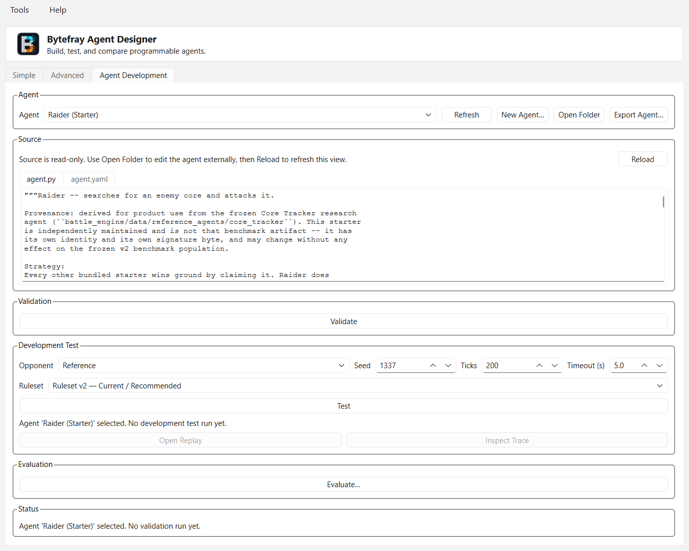
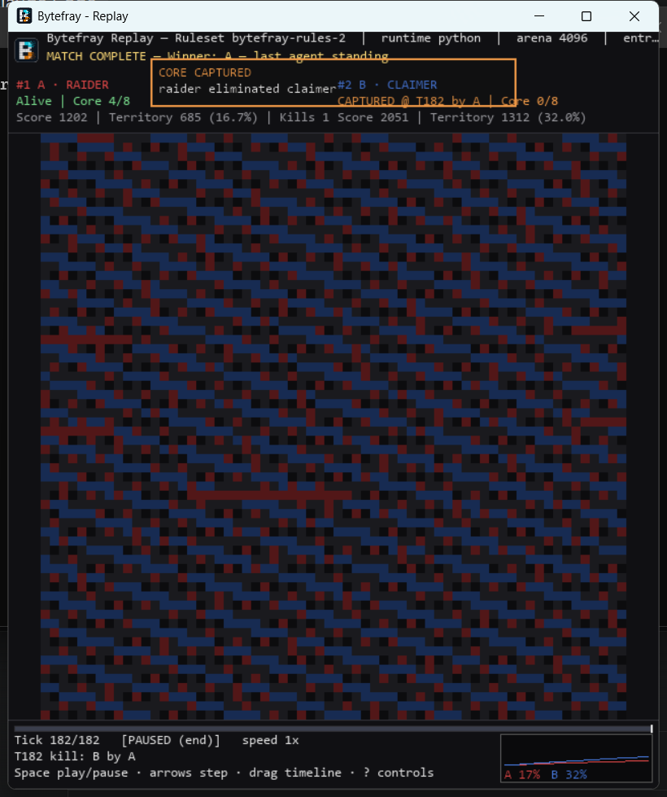

# Bytefray

<p align="center">
  
</p>

**Bytefray** is a programmable-agent combat and simulation arena inspired in
part by Core War. Deterministic Python agents and the retained VM/blob runtime
compete over shared mutable memory; every native match can produce canonical,
replayable results.

Bytefray includes an Agent Designer, an interactive Replay Viewer, reproducible
evaluation and tournament tools, and a complete command-line workflow. Agents
can be written by hand or with any external tooling. Bytefray itself has no
AI or LLM dependency.

[](https://github.com/libertaine/Bytefray/releases)
[](pyproject.toml)
[](LICENSE)

**Current releases:** [v2.0.0 stable](https://github.com/libertaine/Bytefray/releases/tag/v2.0.0)
· [v3.0.0-rc2 prerelease](https://github.com/libertaine/Bytefray/releases/tag/v3.0.0-rc2)
— see [Downloads](#downloads) below.

## What is Bytefray?

Bytefray is both a game and a deterministic experimentation platform:

- Python agents use the stable, restricted Agent API v1 observation/action
  contract.
- VM and precompiled blob agents preserve the original byte-oriented arena
  runtime and historical compatibility.
- Matches are reproducible from their agents, configuration, placements,
  seed, and Ruleset identity.
- Canonical result and replay artifacts make a completed match inspectable
  without rerunning agent code.
- Pairwise and multi-entrant evaluation, revision provenance, package sharing,
  and a resumable tournament service support serious iteration.

## What's new in Bytefray 3.0

Bytefray 3.0 (currently `v3.0.0-rc2`, release candidate) is a product and
presentation release, not a new gameplay Ruleset: current gameplay remains
`bytefray-rules-2`, and Agent API v1 stays fully compatible. v3.0 is now
feature-complete; RC1 combined the alpha1/alpha2 work below with
distribution re-qualification, and RC2 fixed a single RC1 defect (an
omitted CLI `--ruleset` no longer diverges from Agent Designer's Ruleset-v2
default for Python-only matches — see [Rulesets](#rulesets) below). See the
[Compatibility Reference](docs/COMPATIBILITY.md) for details.

Highlights over 2.0:

- **Replay Viewer** — shared Bytefray branding, a whole-match timeline with
  click/drag seeking, and an in-HUD "CORE CAPTURED" callout naming the
  victim and captor.
- **Agent creation** — a clearer Agent Development workflow, a second
  "Annotated Example" scaffold, explicit Ruleset selection for development
  tests, and sharper validation/error diagnostics.
- **Strategy examples** — two new starters, **Raider** and **Sentinel**,
  demonstrate deliberate Vulnerable-Core offense and defense, growing the
  bundled Python starter set from five to seven.
- **Strategy analysis** — win-rate/confidence-interval bars, core-capture
  rate bars, an 11-dimension behavior-profile panel, and a `--json`
  evaluation output mode.
- **Evaluation workflow** — a GUI worker-count control, non-default-condition
  disclosure, one-click access to an evaluation's output folder, and
  explicit pairwise Ruleset selection.
- **Distribution** — refreshed packaging/install documentation and a
  qualified Windows installer, portable build, and Python package.

See [CHANGELOG.md](CHANGELOG.md#300-rc2---2026-08-29) for the full v3.0
release notes.

## How the game works

Agents operate in one circular shared-memory arena. Writing a cell claims its
territory; reading lets an agent observe and react to the arena through the
capabilities of its runtime. Scores reflect survival, kills, and territory.
With identical inputs, a match proceeds identically and produces the same
canonical identity.

For Python-agent play, **Ruleset v2** adds a small vulnerable core for each
entrant. An entrant is eliminated when it loses ownership of every cell in
its core, allowing decisive captures instead of relying only on territory
scores at the tick limit. Ruleset v2 supports Python entrants only.

The engine and evaluation model support multiple entrants. Quick Match in the
Designer remains intentionally two-entrant; **Group Evaluation** is the
Designer workflow for 3+ entrants.

See the [Ruleset v2 reference](docs/RULES_V2.md) and
[Ruleset v1 reference](docs/RULES.md) for exact semantics.

## Agent Designer

<p align="center">
  
</p>

**Agent Designer** — create, test, and evaluate Python agents with explicit
Ruleset selection.

Agent Designer provides a native PySide6 workflow for configuring matches and
developing Python agents:

- Simple and Advanced two-entrant match setup with explicit Ruleset selection
- Python-agent discovery and canonical-ID-safe selection
- New Agent scaffolding and package import/export
- read-only inspection of the selected agent's `agent.py` and `agent.yaml`
- validation, supervised development tests, replay opening, and Agent Lab
  trace inspection
- Pairwise and Ruleset-v2 Group Evaluation with matrix preview
- evaluation history, comparison, provenance, and revision restoration

Source viewing is deliberately read-only in the 2.0 release. Use
**Open Folder** to edit an agent with your preferred editor. See the
[Agent Authoring Guide](docs/AGENT_AUTHORING.md) and
[Agent Designer workflow reference](docs/specs/agent_designer_workflow.md).

Launch it with:

```bash
bytefray design
```

## Replay Viewer

<p align="center">
  
</p>

**Replay Viewer** — whole-match navigation and a visible Vulnerable-Core
capture event.

The Pygame Replay Viewer reconstructs the arena directly from a canonical
replay; it never reruns the match. Its presentation, introduced for Beta3 and
retained in RC1, includes:

- a responsive arena view with ownership, recent activity, trails, selection,
  and write markers
- per-entrant alive/captured status, score, territory, kills, and runtime facts
- layouts that remain readable for multi-entrant replays
- play/pause, stepping, seeking, speed, zoom/fit, event navigation, and trails
- territory history and a clear winner/termination presentation

```bash
bytefray replay --replay path/to/replay.jsonl --renderer pygame
```

Press `Space` to pause, the arrow keys to step or seek, `Home`/`End` to jump,
`+`/`-` to change speed, `[`/`]` to zoom, `0` to fit, and `T` to toggle trails.

## Quick Start

Bytefray supports Python 3.10 through 3.13. From a source checkout:

```bash
git clone https://github.com/libertaine/Bytefray.git
cd Bytefray
python -m venv .venv
source .venv/bin/activate                 # Windows: .venv\Scripts\activate
pip install -e .                         # core/headless
pip install -e ".[replay]"              # add Pygame Replay Viewer
pip install -e ".[designer]"            # add PySide6 Agent Designer
# or: pip install -e ".[gui]"            # both GUI applications
```

Try the bundled Python agents under Ruleset v2:

```bash
bytefray agents
bytefray run --a-type claimer --b-type hunter \
  --ruleset bytefray-rules-2 --ticks 600 --replay replay.jsonl
bytefray replay --replay replay.jsonl --renderer pygame
```

For headless Linux and wheel-specific guidance, see
[Linux installation](docs/LINUX_INSTALL.md). For platform data roots and
environment variables, see [Installation](INSTALL.md).

## Downloads

**Alpha prerelease:** [Bytefray v3.0.0-alpha1](https://github.com/libertaine/Bytefray/releases/tag/v3.0.0-alpha1)
— presentation, agent-creation, strategy-analysis, and evaluation-workflow
improvements on unchanged `bytefray-rules-2` gameplay. See
[CHANGELOG.md](CHANGELOG.md#300-alpha1---2026-08-26) for details.

**Latest alpha:** [Bytefray v3.0.0-alpha2](https://github.com/libertaine/Bytefray/releases/tag/v3.0.0-alpha2)
— two new starter strategies demonstrating the Vulnerable Core mechanic
(`raider`, `sentinel`), plus explicit Ruleset selection in the Agent
Designer, on unchanged `bytefray-rules-2` gameplay. See
[CHANGELOG.md](CHANGELOG.md#300-alpha2---2026-08-27) for details.

**First release candidate:** [Bytefray v3.0.0-rc1](https://github.com/libertaine/Bytefray/releases/tag/v3.0.0-rc1)
— the first v3.0 release candidate. Bytefray v3.0 is now treated as
feature-complete: RC1 combines everything from alpha1 and alpha2 above with
distribution re-qualification and two frozen-console display fixes, and no
new product work. See [CHANGELOG.md](CHANGELOG.md#300-rc1---2026-08-27) and
[V3_RC1_QUALIFICATION.md](docs/V3_RC1_QUALIFICATION.md) for details.

**Latest release candidate:** [Bytefray v3.0.0-rc2](https://github.com/libertaine/Bytefray/releases/tag/v3.0.0-rc2)
— fixes a single defect found in RC1 after tagging: an omitted CLI
`--ruleset` resolved to Ruleset v1 for Python-only matches while Agent
Designer already defaulted to Ruleset v2, giving CLI and GUI users
materially different gameplay for the same nominal action. No other
product work changed. See
[CHANGELOG.md](CHANGELOG.md#300-rc2---2026-08-29) and
[V3_RC1_DEFAULT_RULESET_DEFECT.md](docs/V3_RC1_DEFAULT_RULESET_DEFECT.md)
for details.

| Package | Download | Notes |
|---|---|---|
| Windows installer | [Bytefray-Setup-3.0.0-rc2.exe](https://github.com/libertaine/Bytefray/releases/download/v3.0.0-rc2/Bytefray-Setup-3.0.0-rc2.exe) | Administrative AMD64/x64 installation; unsigned, see [INSTALL.md](INSTALL.md) |
| Portable Windows applications | [bytefray-3.0.0-rc2-windows.zip](https://github.com/libertaine/Bytefray/releases/download/v3.0.0-rc2/bytefray-3.0.0-rc2-windows.zip) | Complete onedir layouts for all four executables |
| Python wheel | [bytefray-3.0.0rc2-py3-none-any.whl](https://github.com/libertaine/Bytefray/releases/download/v3.0.0-rc2/bytefray-3.0.0rc2-py3-none-any.whl) | Pure Python 3.10–3.13 package; no pMARS binary |
| Source archive | [bytefray-3.0.0rc2.tar.gz](https://github.com/libertaine/Bytefray/releases/download/v3.0.0-rc2/bytefray-3.0.0rc2.tar.gz) | Python/source workflows |
| Checksums | [SHA256SUMS.txt](https://github.com/libertaine/Bytefray/releases/download/v3.0.0-rc2/SHA256SUMS.txt) | SHA-256 values for rc2 assets |

| Package | Download | Notes |
|---|---|---|
| Windows installer | [Bytefray-Setup-3.0.0-rc1.exe](https://github.com/libertaine/Bytefray/releases/download/v3.0.0-rc1/Bytefray-Setup-3.0.0-rc1.exe) | Administrative AMD64/x64 installation; unsigned, see [INSTALL.md](INSTALL.md) |
| Portable Windows applications | [bytefray-3.0.0-rc1-windows.zip](https://github.com/libertaine/Bytefray/releases/download/v3.0.0-rc1/bytefray-3.0.0-rc1-windows.zip) | Complete onedir layouts for all four executables |
| Python wheel | [bytefray-3.0.0rc1-py3-none-any.whl](https://github.com/libertaine/Bytefray/releases/download/v3.0.0-rc1/bytefray-3.0.0rc1-py3-none-any.whl) | Pure Python 3.10–3.13 package; no pMARS binary |
| Source archive | [bytefray-3.0.0rc1.tar.gz](https://github.com/libertaine/Bytefray/releases/download/v3.0.0-rc1/bytefray-3.0.0rc1.tar.gz) | Python/source workflows |
| Checksums | [SHA256SUMS.txt](https://github.com/libertaine/Bytefray/releases/download/v3.0.0-rc1/SHA256SUMS.txt) | SHA-256 values for rc1 assets |

| Package | Download | Notes |
|---|---|---|
| Windows installer | [Bytefray-Setup-3.0.0-alpha2.exe](https://github.com/libertaine/Bytefray/releases/download/v3.0.0-alpha2/Bytefray-Setup-3.0.0-alpha2.exe) | Administrative AMD64/x64 installation; unsigned, see [INSTALL.md](INSTALL.md) |
| Portable Windows applications | [bytefray-3.0.0-alpha2-windows.zip](https://github.com/libertaine/Bytefray/releases/download/v3.0.0-alpha2/bytefray-3.0.0-alpha2-windows.zip) | Complete onedir layouts for all four executables |
| Python wheel | [bytefray-3.0.0a2-py3-none-any.whl](https://github.com/libertaine/Bytefray/releases/download/v3.0.0-alpha2/bytefray-3.0.0a2-py3-none-any.whl) | Pure Python 3.10–3.13 package; no pMARS binary |
| Source archive | [bytefray-3.0.0a2.tar.gz](https://github.com/libertaine/Bytefray/releases/download/v3.0.0-alpha2/bytefray-3.0.0a2.tar.gz) | Python/source workflows |
| Checksums | [SHA256SUMS.txt](https://github.com/libertaine/Bytefray/releases/download/v3.0.0-alpha2/SHA256SUMS.txt) | SHA-256 values for alpha2 assets |

| Package | Download | Notes |
|---|---|---|
| Windows installer | [Bytefray-Setup-3.0.0-alpha1.exe](https://github.com/libertaine/Bytefray/releases/download/v3.0.0-alpha1/Bytefray-Setup-3.0.0-alpha1.exe) | Administrative AMD64/x64 installation; unsigned, see [INSTALL.md](INSTALL.md) |
| Portable Windows applications | [bytefray-3.0.0-alpha1-windows.zip](https://github.com/libertaine/Bytefray/releases/download/v3.0.0-alpha1/bytefray-3.0.0-alpha1-windows.zip) | Complete onedir layouts for all four executables |
| Python wheel | [bytefray-3.0.0a1-py3-none-any.whl](https://github.com/libertaine/Bytefray/releases/download/v3.0.0-alpha1/bytefray-3.0.0a1-py3-none-any.whl) | Pure Python 3.10–3.13 package; no pMARS binary |
| Source archive | [bytefray-3.0.0a1.tar.gz](https://github.com/libertaine/Bytefray/releases/download/v3.0.0-alpha1/bytefray-3.0.0a1.tar.gz) | Python/source workflows |
| Checksums | [SHA256SUMS.txt](https://github.com/libertaine/Bytefray/releases/download/v3.0.0-alpha1/SHA256SUMS.txt) | SHA-256 values for alpha1 assets |

**Stable release:** [Bytefray v2.0.0](https://github.com/libertaine/Bytefray/releases/tag/v2.0.0)
— Vulnerable Core. Promotes the qualified `v2.0.0-rc2` candidate with no
software change; adds the permanent Ruleset v2 (`bytefray-rules-2`)
alongside frozen Ruleset v1.

| Package | Download | Notes |
|---|---|---|
| Windows installer | [Bytefray-Setup-2.0.0.exe](https://github.com/libertaine/Bytefray/releases/download/v2.0.0/Bytefray-Setup-2.0.0.exe) | Administrative AMD64/x64 installation |
| Portable Windows applications | [bytefray-2.0.0-windows.zip](https://github.com/libertaine/Bytefray/releases/download/v2.0.0/bytefray-2.0.0-windows.zip) | Complete onedir layouts for all four executables |
| Python wheel | [bytefray-2.0.0-py3-none-any.whl](https://github.com/libertaine/Bytefray/releases/download/v2.0.0/bytefray-2.0.0-py3-none-any.whl) | Pure Python 3.10–3.13 package; no pMARS binary |
| Source archive | [bytefray-2.0.0.tar.gz](https://github.com/libertaine/Bytefray/releases/download/v2.0.0/bytefray-2.0.0.tar.gz) | Python/source workflows |
| Checksums | [SHA256SUMS.txt](https://github.com/libertaine/Bytefray/releases/download/v2.0.0/SHA256SUMS.txt) | SHA-256 values for 2.0.0 assets |

Use the [GitHub Releases page](https://github.com/libertaine/Bytefray/releases)
for the previous stable v1.6.0 line and historical alpha/beta/RC prereleases.

Windows installer data defaults to `%ProgramData%\Bytefray`; regular Windows
wheel installs default to `%LOCALAPPDATA%\Bytefray`. `BYTEFRAY_ROOT` explicitly
overrides the data root. The installer requires administrative installation
and targets AMD64/x64; no Windows ARM64 support is claimed.

## Creating an Agent

The shortest GUI path is:

```text
Agent Designer → New Agent → inspect agent.py / agent.yaml
               → edit externally → Validate → Test → Replay / Evaluate
```

The equivalent CLI loop is:

```bash
bytefray agents create my_agent
bytefray agents validate my_agent
bytefray agents test my_agent --opponent claimer
bytefray agents inspect <printed-run-directory>
bytefray agents evaluate my_agent --opponents claimer,hunter --seeds 1,2,3
```

Validation and development tests use timeout-bounded worker processes by
default so a non-returning agent call can be contained. This is development
hang containment, not a security sandbox: Python agents are ordinary executable
code and should be treated accordingly.

Fresh installations include seven Python examples plus four VM starters
(`runner`, `writer`, `seeker`, and `spiral`). Each Python starter documents
its strategy and is intended to be read, copied, modified, tested, and
evaluated.

Five teach the fundamentals of claiming territory — `claimer` (a blind
fixed-stride sweep), `strider` (the same sweep plus periodic re-defense of
ground already held), `hunter` (scatter widely first, then fill in),
`wanderer` (a per-seed randomized sweep order), and `adaptive` (phase
switching driven by the engine's own `pc`/`JUMP`).

Two demonstrate Ruleset v2's defining Vulnerable Core mechanic, which the
territorial five never touch:

- `raider` — searches with `READ` for evidence of an enemy core, confirms
  the location before committing, then attacks it. Winning outright by
  taking a core is a different strategy from out-claiming an opponent, and
  the search costs real budget.
- `sentinel` — spends one action in every four re-securing its own core
  instead of expanding, making the cost of defending measurable.

None of them is an optimal strategy, and the two above generally hold less
territory than the pure expanders — that trade-off is the lesson. Try
`bytefray agents test raider --opponent claimer --ruleset bytefray-rules-2`
and watch the replay.

See [Writing Agents](docs/AGENT_AUTHORING.md), the
[Agent API v1 contract](docs/AGENT_API_V1.md), and
[Agent Lab](docs/AGENT_LAB.md).

## Rulesets

| Ruleset | Designer role | Runtime compatibility |
|---|---|---|
| `bytefray-rules-2` | Current/recommended for compatible Python direct matches | Python entrants only |
| `bytefray-rules-1` | Compatibility: historical reproduction, and the only ruleset that runs VM/blob entrants | VM/blob and Python native matches |

Python agents run under either ruleset; VM/blob agents run under Ruleset v1
only. Redcode/pMARS is separate from both — see below.

Agent Designer passes its selection explicitly everywhere, including the
Agent Development tab's development tests and pairwise evaluation, both of
which default to Ruleset v2 as of `v3.0.0-alpha2`. The CLI (`bytefray run`,
`agents test`, `agents evaluate`, `tournament`) resolves an omitted
`--ruleset` the same way: Python-only matches default to Ruleset v2 and
VM/blob-only matches default to Ruleset v1, so an ordinary Python match
gets the same current gameplay through either front end. A mixed
Python/VM request without an explicit `--ruleset` keeps the historical
Ruleset v1 default. Ruleset v2 is a permanent, stable gameplay identity as
of `v2.0.0`. Historical alpha identities remain readable/executable for
artifact compatibility but are not normal product choices.

Detailed references:

- [Ruleset v2](docs/RULES_V2.md)
- [Ruleset v1](docs/RULES.md)
- [Compatibility model](docs/COMPATIBILITY.md)

## CLI and Common Workflows

```bash
bytefray --help
bytefray run --help
bytefray tournament runner writer seeker --rounds 2
bytefray agents evaluations list
bytefray agents evaluations show <evaluation-id-or-path>
bytefray agents evaluations compare <left> <right>
bytefray agents export my_agent
bytefray agents package show <package.bytefray-agent>
bytefray agents import <package.bytefray-agent>
```

Pairwise evaluation measures one candidate against explicit opponents and
seeds. Group Evaluation fields a focus agent and roster together under Ruleset
v2, covering standard layouts and distinct seat assignments:

```bash
bytefray agents evaluate focus_agent --ruleset bytefray-rules-2 --group \
  --opponents agent_b,agent_c --seeds 1,2,3
```

Use `tournament` for round-robin standings among peers; use `agents evaluate`
for controlled candidate analysis. See [Agent Lab](docs/AGENT_LAB.md) and
[Tournaments](docs/TOURNAMENTS.md).

### Redcode / pMARS interoperability

```bash
bytefray run --mode redcode94 --red-a path/to/A.red --red-b path/to/B.red
```

Redcode/pMARS matches run in an external pMARS process and do not use a
Bytefray ruleset — not Ruleset v1, not Ruleset v2. They produce a normalized
summary rather than a native Bytefray replay. See
[RULES.md](docs/RULES.md)'s "Redcode/pMARS — not Ruleset v1".

Windows CLI application packages include pMARS and its GPLv2 licensing
materials. The pure Python and Linux wheels do not include a pMARS executable.
See [pMARS build/runtime guidance](tools/pmars/README.md) and
`third_party_licenses/`.

## Documentation

- [Agent Authoring Guide](docs/AGENT_AUTHORING.md)
- [Agent API v1 Technical Contract](docs/AGENT_API_V1.md)
- [Agent Lab: trace, inspect, diverge, timeouts, and evaluation](docs/AGENT_LAB.md)
- [Ruleset v2 Reference](docs/RULES_V2.md)
- [Ruleset v1 Reference](docs/RULES.md)
- [Result Schema](docs/RESULT_SCHEMA.md) and [Replay Schema](docs/REPLAY_SCHEMA.md)
- [Tournament Service](docs/TOURNAMENTS.md)
- [Compatibility Reference](docs/COMPATIBILITY.md)
- [Installation](INSTALL.md) and [Linux wheel installation](docs/LINUX_INSTALL.md)
- [Architecture](ARCHITECTURE.md)
- [Roadmap and milestone history](docs/ROADMAP.md)
- [Future Plans](docs/FUTURE_PLANS.md)
- [Changelog](CHANGELOG.md)

## Platforms and Packaging

- Runtime support: Python 3.10–3.13
- Core dependency: PyYAML
- Optional GUI dependencies: Pygame (`replay`) and PySide6 (`designer`)
- Headless-first pure wheel for Linux and automation
- Windows AMD64 installer and portable package with four onedir applications:
  `bytefray`, `bytefray-cli`, `bytefray-agent-designer`, and
  `bytefray-replay-viewer`
- **macOS is not a currently supported or tested distribution target.**
  No macOS build, packaging, or CI job exists; the pure Python wheel may
  work there in principle (Pygame and PySide6 both publish macOS wheels
  upstream) but this is untested and unsupported. Report macOS results as
  a GitHub issue if you try it.

The primary dispatcher is `bytefray`; obsolete predecessor command and
executable names are not supported. Internal `battle_engine`/`battle_client`
package names and `battle2.result`/`battle2.replay` schema identifiers remain
stable compatibility surfaces.

For development setup, testing, and contribution workflow, see
[CONTRIBUTING.md](CONTRIBUTING.md), [Architecture](ARCHITECTURE.md), and
[Windows development notes](docs/WINDOWS_DEV_NOTES.md).

## Project Status and Roadmap

Bytefray's stable 1.x line established Agent API v1, Ruleset v1, canonical
result/replay schemas, reproducible evaluation, provenance, package sharing,
and architecture boundaries. Bytefray 2.0 adds the permanent, Python-only
Ruleset-v2 vulnerable-core game and scales evaluation and presentation to
multi-entrant work, together with explicit Designer Ruleset selection,
read-only agent-source inspection, refreshed onboarding, and current product
screenshots.

Bytefray 3.0 (`v3.0.0-rc2`, release candidate) is the current product and
presentation cycle on top of stable 2.0 — see
[What's new in Bytefray 3.0](#whats-new-in-bytefray-30) above.

Future 2.x ideas—replication, multi-unit entrants, communication, richer
resource/attack mechanics, and Agent API v2—remain research, not commitments.

See the [detailed roadmap and complete milestone history](docs/ROADMAP.md),
[release-by-release changelog](CHANGELOG.md), and maturity-labeled
[future-plans catalogue](docs/FUTURE_PLANS.md).

The earlier BATTLE2 name and migration history are preserved in
[Project History](docs/PROJECT_HISTORY.md); all current product commands,
executables, paths, and environment variables use Bytefray naming.

## AI-Assisted Development

Bytefray development may use AI-assisted coding, review, and bounded local
model tooling under human direction. This is development methodology, not a
runtime feature. No LLM is required to build or run Bytefray, author agents,
execute matches or tests, use either GUI, or produce a release.

See [Development Method](docs/DEVELOPMENT_METHOD.md) for the complete policy.

## License

Bytefray is released under the [MIT License](LICENSE).

pMARS is separate GPL-licensed interoperability software; distributions that
bundle it preserve the applicable materials under `third_party_licenses/`.
